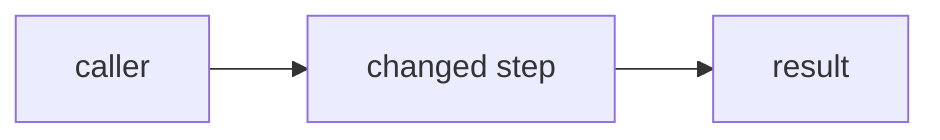

<!-- markdownlint-disable MD033 MD041 -->
<!--
Written by an agent, read by a human. Optimize for the reviewer's time.
- The diff shows WHAT. This text adds what code can't: intent, the approach, the alternative you rejected, and what's out of scope. Don't restate the diff.
- The Tour is the heart of this PR: walk the reviewer through the diff in REVIEW order, not file order, so they never have to guess where to start.
- Be calibrated, not confident: surface assumptions, guesses, and anything a human must double-check.
- Show evidence, not promises: paste the real command(s) and their actual output.
- Make every file reference a CLICKABLE link into this PR's diff so the reviewer lands on it in one click:
  [`path/to/file.ts`](https://github.com/OpenRouterIncubator/templates/pull/<PR>/files#diff-<sha256-of-the-path>)
  Use the file-level `#diff-<sha256-of-the-path>` anchor with NO R<line>: it keeps working as you push more commits, whereas added-line numbers shift on every push and go stale. Optionally append R<line> (right side) or L<line> (left) to the SINGLE "start here" pointer if an exact entry line helps.
  Get the hash with: printf '%s' 'path/to/file.ts' | shasum -a 256 ; get <PR> with: gh pr view --json number.
  Fallback if you don't know the PR number yet: a commit permalink https://github.com/OpenRouterIncubator/templates/blob/<commit-sha>/path/to/file.ts#L10-L20.
- Always include the Diagram. Delete any other section/bullet that's empty, EXCEPT Security (leave an explicit "None" so the reviewer knows you checked).
- Aim for an under-2-minute read.
- In How I verified, give functional proof (real output) — not lint/typecheck/test commands; those belong in the Checklist, and CI re-runs them.
- Include a copy-paste "Test it yourself" prompt for anything with runtime behavior so a reviewer can exercise it; delete that section for docs-only PRs.
- Provenance: always fill the prompt summary + round-trips; optionally link a shareable agent-session URL (review it for secrets first — anyone with the link can read it).
- Small PR (<200 LOC): Overview, a 1-stop Tour, Diagram, and Checklist is enough. Large PR (>500 LOC): full Tour + Additional details.
- The PR TITLE must be a Conventional Commit (feat/fix/chore/docs/refactor/perf/test/build/ci/style/revert) — CI lints it.
- Keep it fresh: after pushing new commits, REFRESH this description (Tour, Diagram, How I verified, Checklist) to match the new diff and bump Round-trips — a stale description is worse than none.
-->

> Type: feat/fix/refactor/docs/… · Risk: low/med/high · Size: ~NN LOC · Areas: templates, ci, docs · Confidence: high/med/low

## Overview

<!-- Tight bullets, not prose. Plain and specific. No filler ("This PR introduces…"), no hedging, no restating the title. -->

- What:
- Why (link the issue):
- Main risk:

## Review focuses

<!-- Imperative bullets aimed at the reviewer: what to confirm, spot-check, or decide. Where their attention is worth most. -->

-

## Tour

<!--
A guided, ordered walkthrough of the diff (like Graphite's Tour) so the reviewer reads in review
order, not file order. One stop per logical chunk. For each stop give a title, the file(s) it covers,
and 1-2 sentences on what it does and what to check. Lead with the critical path and mark it; order
foundational/shared code before the call sites that depend on it. A trivial PR can have one stop.
Each file MUST be a clickable link into this PR's diff (see the URL recipe in the top comment); use the
file-level #diff-<hash> anchor so the links don't break as you push more commits.
-->

1. **<stop title>** —
   [`path/to/file.ts`](https://github.com/OpenRouterIncubator/templates/pull/<PR>/files#diff-<sha256-of-the-path>) — what
   this chunk does and what to look at. _(start here / critical path)_
2. **<stop title>** —
   [`path/to/other.ts`](https://github.com/OpenRouterIncubator/templates/pull/<PR>/files#diff-<sha256-of-the-path>) — what
   changed and why.

## Diagram

<!--
Always include one. Show the changed flow/sequence or a before -> after of the critical path.
Keep it small (a few nodes); a trivial PR can use a 2-3 node before -> after.
Valid mermaid: no spaces in node IDs (camelCase/underscores); quote labels with special
characters; no colors/styling (breaks dark mode); avoid reserved IDs (end, graph, subgraph); no click events.
-->



## How I verified

<!--
Functional proof only (CI owns check/typecheck/test). Paste the command(s) and the
real result, with expected vs actual. For CLI changes, show before/after output.
-->

```sh

```

## Test it yourself

<!--
A prompt a reviewer can paste into their own coding agent to exercise this change by hand.
Fill in the branch, template, and concrete steps. Delete for docs-only PRs.
-->

```text
Check out the `<branch>` branch of OpenRouterIncubator/templates and `cd <template>`.
Install and exercise the change:
  bun install
  bun test
  # or run the feature command, e.g.:  ori <feature-id> <command> <args>
1. <step>
2. <step>
Expected: <what the reviewer should see>.
Report anything off.
```

## Notes

<!-- One line each; delete a bullet if it's genuinely empty. -->

- Approach & alternative considered:
- Out of scope / follow-ups:
- Assumptions / unsure (needs your judgment):
- New utilities or deps (and why they don't duplicate existing code):
- CI / workflow changes (or "None"):

## How this PR was built

<!--
Provenance: how the human got to this outcome.
- Agent session: optional shareable link to the chat/session. REVIEW IT FOR SECRETS FIRST (anyone with the link can read it). Omit the line if you can't/won't share.
- The Prompt summary and Round-trips lines are REQUIRED even when no link is shared.
-->

- Agent session (optional): <shareable link, or omit>
- Prompt summary: <1-2 lines: what the human originally asked for + any major course-corrections>
- Round-trips: ~<N> back-and-forth iterations

<details>
<summary>Additional details (open only if needed)</summary>

### Breaking changes

<!-- "None" if none. Otherwise name what's affected and the migration path. -->

### Security & privacy

<!-- "None" if none. Otherwise secrets, scraped data, PII, anything a security reviewer should know. -->

### Related work

<!-- Delete if none. Stacked/parent/child PRs, linked issues, follow-ups. -->

</details>

## Checklist

<!-- Check only what's true; these are your attestations. -->

- [ ] `bun run check` (ultracite) clean in the touched template(s).
- [ ] `bun run typecheck` clean.
- [ ] `bun test` passing; no `.only`/`.skip`.
- [ ] New template has `package.json`, `README.md`, and a row in the root README templates table.
- [ ] Tests live next to source; pure logic is unit-tested and I/O is isolated.
- [ ] Strict TypeScript; no `any`; imports from concrete modules (no barrel files).
- [ ] One idea per PR; fits the existing template layout.

<!-- Optional machine-readable metadata for bots. Tools may auto-populate these. -->
<!--
```json
{
  "pr_type": "feat|fix|perf|refactor|docs|test|build|ci|chore|revert",
  "risk": "low|medium|high",
  "breaking_change": false,
  "areas_touched": ["templates", "ci", "docs"],
  "dependencies": { "added": [], "removed": [], "updated": [] },
  "agent_confidence": "low|medium|high",
  "agent_session_url": "",
  "agent_round_trips": 0
}
```
-->
